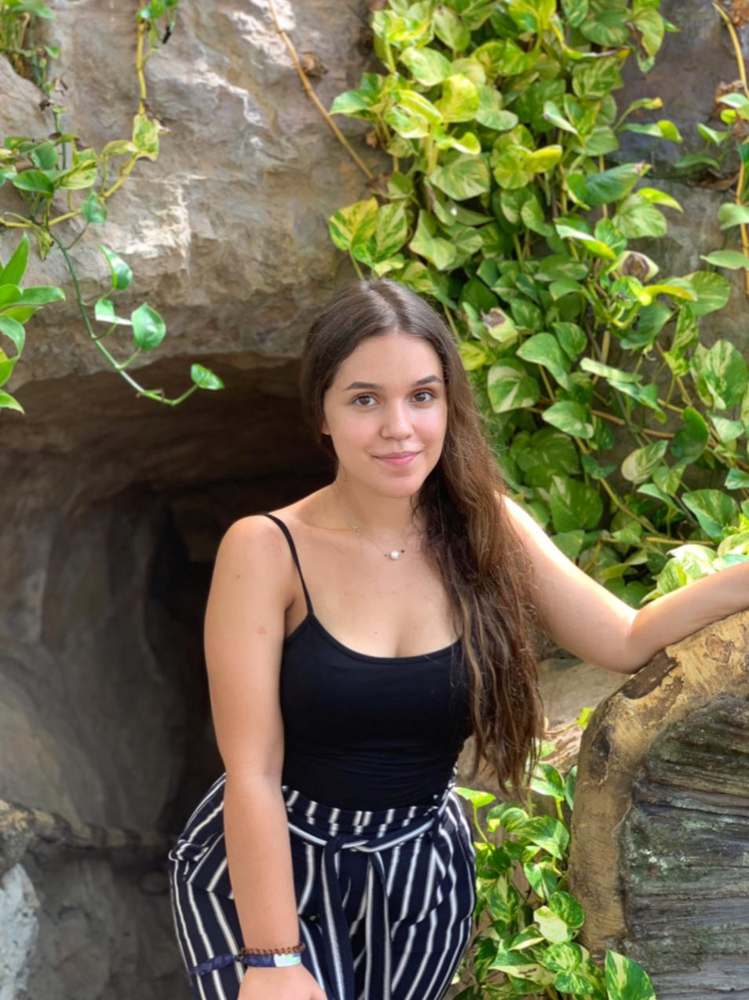
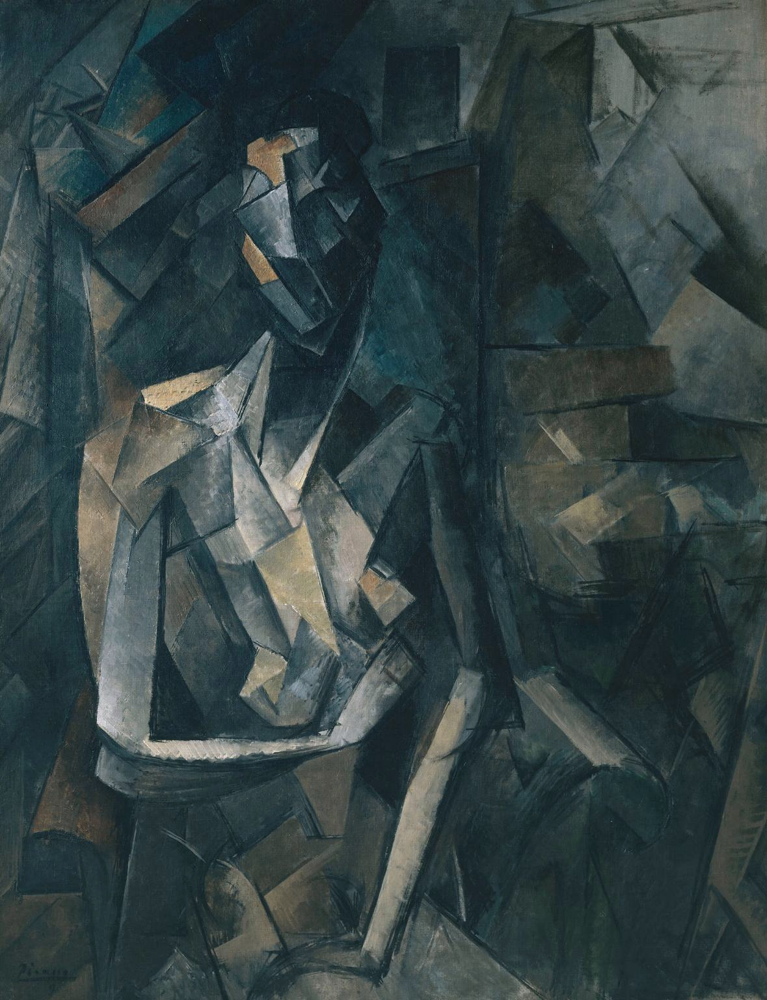
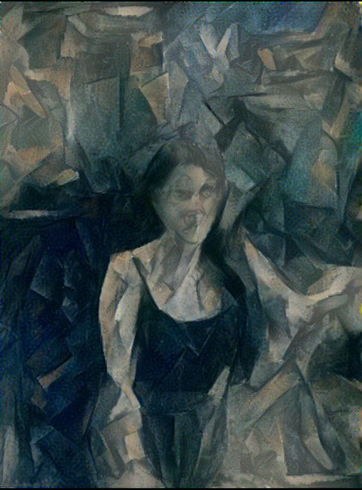

# Neural-Style-Transfer
Neural style transfer with optional video implementation

Due to the implementation, the style transfer takes around 5 minutes per frame, next step will be to use
a feed forward network with image transformation 

Content Image:

Style Image:

Result of applying style transfer to the content Image:

